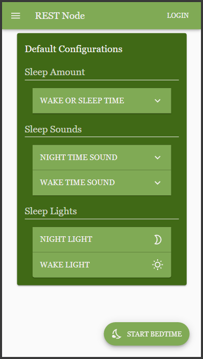
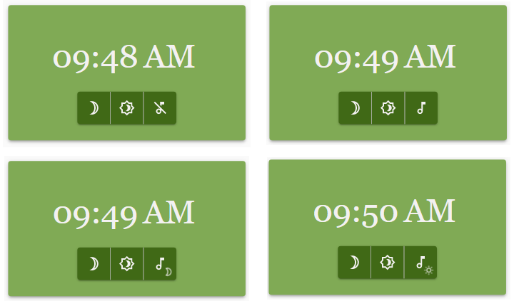
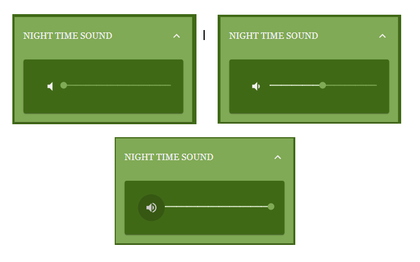
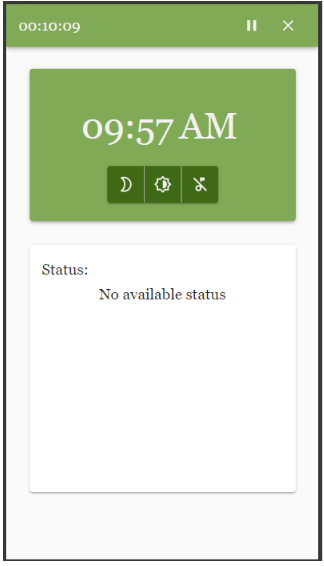
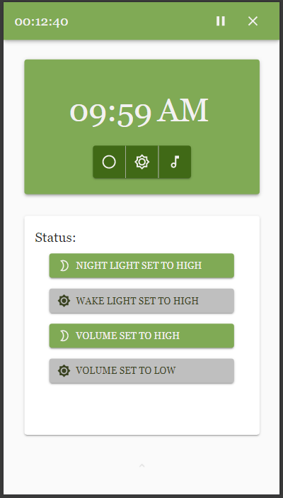

# ExistTribe ReactApp V1
	
The app is currently being served by an NR server with the help of the uibuilder package for controlling the different interactions happening from the UI to the server and vice versa.

## 09/10/21 
### Changes:
- Added the default configurations in the Home Page of the REST Node (The user can toggle and configure the settings here that in which the settings values will persist until updated here)
- Added the toggle shortcut for the background sound/music state where the user can click up to four(4) times up until it cycles again. The order of the state are as follows: **mute**, **both**, **nightTimeSound**, **wakeTimeSound**
- Changed the volume/brightness stops from (34, 67, 100), to (0, 50, 100) which is corresponding to levels low, medium, and high respectively
- Added the statuses in the status card in which each statuses show to the user the summary of the current setting or sleep configurations he/she has applied

### Screenshots of the Changes

### Default Configurations

 

### Background Music Toggle Shortcut

 

### Volume/Brightness Stops Changed

 

### Statuses

 

 

## 09/09/21
### Changes:
- Added a Material UI time picker for selecting the wake time and sleep time
- Added different volume and brightness levels adjustments on click of a button or on adjust of the slider
- Added functionality to interact with the volume and brightness levels to the shortcut buttons found in the Main Digital Clock, for easier accessibility
- Added section headers in the settings drawer for easier navigation
- Made the look of the settings in the start bedtime drawer to look more uniform by using an accordion menu

## Screenshots of the changes:

### Sleep Time and Wake Time Picker (have to modify SleepTime so that it only sets the number of hours and minutes, not the time itself)

 

### Sound Volume levels Adjustment

 

###  Brightness Adjustment

 

###  Bedtime Settings Drawer (Will reuse this component for the default sleep configurations in the main dashboard)

 

###  Shortcut Controls

 

