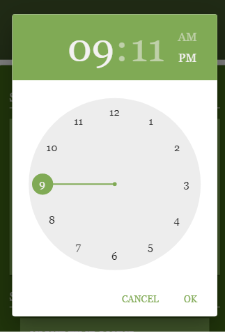
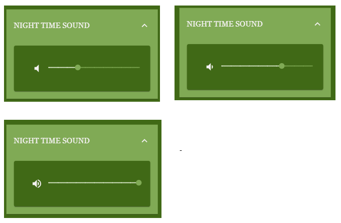
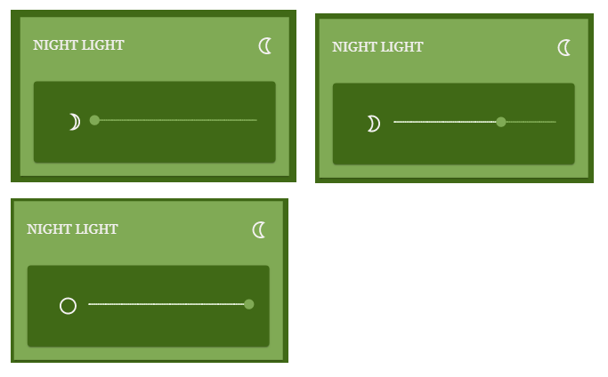
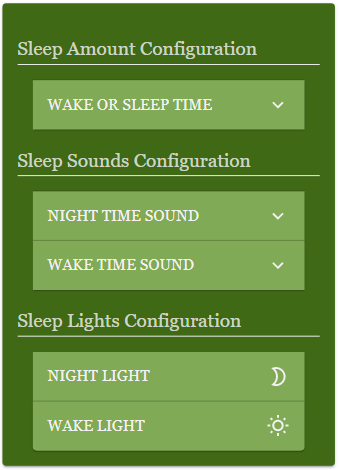
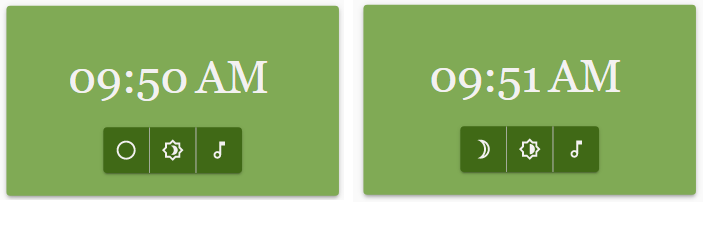

# ExistTribe ReactApp V1
	
The app is currently being served by an NR server with the help of the uibuilder package for controlling the different interactions happening from the UI to the server and vice versa.

## 09/09/21
## Recent changes added:
- Added a Material UI time picker for selecting the wake time and sleep time
- Added different volume and brightness levels adjustments on click of a button or on adjust of the slider
- Added functionality to interact with the volume and brightness levels to the shortcut buttons found in the Main Digital Clock, for easier accessibility
- Added section headers in the settings drawer for easier navigation
- Made the look of the settings in the start bedtime drawer to look more uniform by using an accordion menu

## Screenshots of the changes:

### Sleep Time and Wake Time Picker (have to modify SleepTime so that it only sets the number of hours and minutes, not the time itself)

 

### Sound Volume levels Adjustment

 

###  Brightness Adjustment

 

###  Bedtime Settings Drawer (Will reuse this component for the default sleep configurations in the main dashboard)

 

###  Shortcut Controls

 

